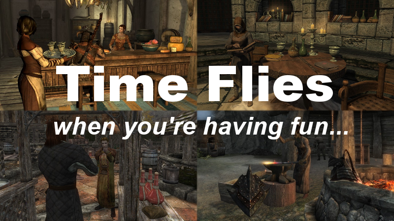
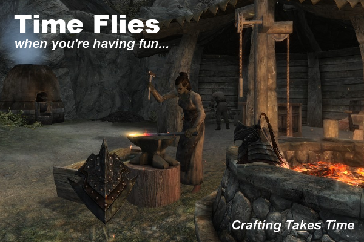
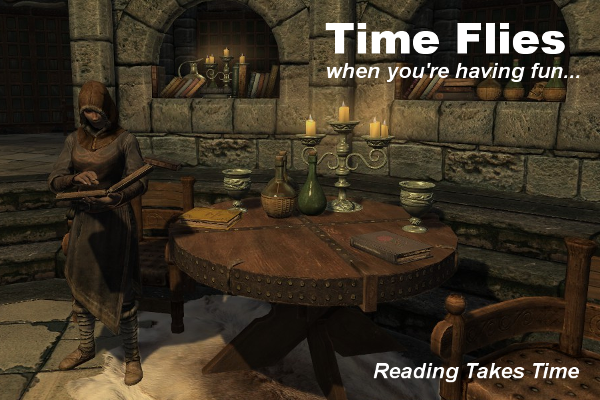
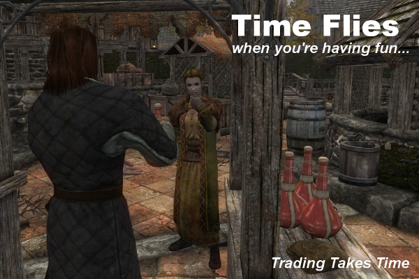
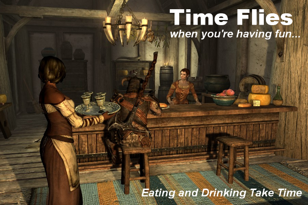
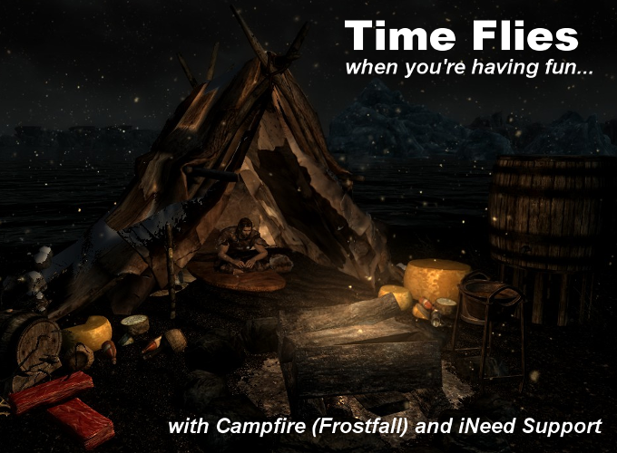

(Available on Nexus Mods: <http://www.nexusmods.com/skyrim/mods/74512>)

## Description
If you use basic needs mod like RND, iNeed or IMCN to enhance your gameplay,
you may want a mod to make time pass when you perform actions like
crafting, reading, eating etc. Then this might be the mod you're looking for.

This mod is based on Akezhar's
[Living Takes Time](http://www.nexusmods.com/skyrim/mods/44623/). Since he's
discontinuing the development of the mod and provides the source for anyone
who wants to pick it up, feel free to to modify or redistribute this mod.
No permission needed!

## Requirements
[SKSE](http://skse.silverlock.org/) and [SkyUI](http://www.nexusmods.com/skyrim/mods/3863/).
And [FISS](http://www.nexusmods.com/skyrim/mods/48265/)
if you want to save or load your own settings.

Supported mods are **NOT REQUIRED** to run this mod.
However, if you install any supported mod afterwards, you need to reinitialize
Time Flies in MCM to make it recognize them.

## Features
* Make game time pass when crafting, reading, looting, lockpicking, trading,
  eating, training and learning spell. All configurable in MCM.
* Crafting different items takes different amount of time.
  Crafting takes time of an exact value or a random value within a range.
* Reading increases speech skill based on time spent reading.
* Hotkey to pause time passing function in special situations.

## Recommendations
* `set timescale to 6` for more immersive experience.
* Use time widget mods like [A Matter of Time](http://www.nexusmods.com/skyrim/mods/44091/).
* Use [Complete Crafting Overhaul Remade](http://www.nexusmods.com/skyrim/mods/49791/)
  for bulk production to save time.

## Differences compared to Living Takes Time
Like I said, this is a modified version of Living Takes Time.
I removed some parts, added something new, and did refactoring with the others.

Here is a list about differneces compared to Living Takes Time:
* "Expertise reduces time" replaced by "Random crafting time"
    * Life is more interesting with all the variables.
    * Some items may belong to the same category,
      that doesn't mean it takes the same time crafting them.
    * When crafting, the time you spent may varies from x% to y% of
      the value you set (by default that's 67% to 100%).
* "Block x while in combat" removed
    * It's a hardcore option and I may like it if
      there is a better way to block menu opening than
      closing them forcibly after player opening the menu.
* "Crafting takes time" improved
    * Clothes and armors crafting time can be configured separately now.
    * Tanning and smelting time can be configured separately now.
    * Misc items should be ignored in most situations for better compatibility.
    * Also, something like cutting leather into strips
      doesn't take "considerable" time.
* "Hearthfire takes time" added
    * Rome wasn't built in a day. So does your mansion.
* "Level Up takes time", "Preparing takes time" removed
    * I think those menus should be considered as time-pausing elements.
* Some multipliers merged
    * Looting time multiplier and pickpocket time multiplier merged.
    * Barter time multiplier and gifting time multiplier merged.

## Known Issues
There is a small chance that unnecessary time will pass
when separating backpack or removing bed roll from tent.

Currently I rely on item removing event to determine
whether player is separating backpack or removing bed roll.

However, when "crafting" those items,
item removing event doesn't alway triggered before item adding event.

Hence, there is no guarantee that Time Flies will work properly in these situations.

Set a pause hotkey if you need.

## Credits
All credits to Akezhar, the original Living Takes Time's author.
I really enjoyed his mod for a long time.

And to those who created mod-compatible versions of Living Takes Time
(dragonsong, DrPastah, mlheur and anyone not mentioned).
Haven't I tried those mods and read their source code,
I won't realize that it's not difficult to customized Living Takes Time and
then make this mod.

Special thanks to sirtaj for his or her
[vim-papyrus](https://github.com/sirtaj/vim-papyrus) plugin.
I definitely won't make this mod with notepad. :D

## Some Posters

